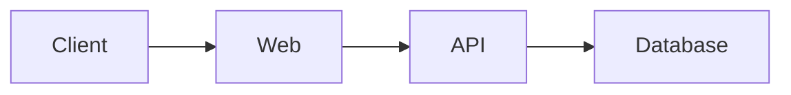

# 23B — ARCHITECTURE & ADR

> Software Engineering Playbook
>
> Diretrizes para documentação de arquitetura, ADRs, RFCs, Design Docs, diagramas, decisões técnicas, trade-offs e evolução arquitetural.

---

# 1. OBJETIVO

Este documento define como arquitetura e decisões técnicas devem ser documentadas.

O objetivo é permitir que pessoas e agentes de IA consigam entender:

- como o sistema está estruturado;
- por que ele foi estruturado dessa forma;
- quais decisões foram tomadas;
- quais alternativas foram consideradas;
- quais restrições existem;
- quais trade-offs foram aceitos;
- como a arquitetura pode evoluir.

Princípio central:

> Arquitetura sem contexto vira arqueologia.

---

# 2. ARQUITETURA NÃO É APENAS DIAGRAMA

Arquitetura envolve:

- componentes;
- responsabilidades;
- fronteiras;
- dados;
- integrações;
- dependências;
- infraestrutura;
- segurança;
- operação;
- decisões;
- restrições.

Um diagrama é apenas uma representação.

---

# 3. DOCUMENTAR O QUE IMPORTA

Não documentar cada classe ou função.

Priorizar decisões e estruturas que afetam:

- manutenção;
- escalabilidade;
- segurança;
- disponibilidade;
- integração;
- operação;
- evolução.

---

# 4. DOCUMENTAÇÃO ARQUITETURAL

Pode incluir:

- visão de contexto;
- containers;
- componentes;
- fluxos;
- dados;
- infraestrutura;
- integrações;
- ADRs;
- RFCs;
- Design Docs.

---

# 5. CURRENT STATE

A arquitetura atual deve estar claramente identificada.

Usar:

AS-IS

para representar estado existente.

---

# 6. FUTURE STATE

Arquitetura planejada deve ser identificada como:

TO-BE

Não apresentar arquitetura futura como implementada.

---

# 7. TRANSITION STATE

Migrações podem exigir representação intermediária.

Exemplo:

AS-IS
↓
TRANSITION
↓
TO-BE

---

# 8. SOURCE OF TRUTH

Definir onde está a arquitetura oficial.

Pode ser:

`docs/architecture/`

Não espalhar versões conflitantes em múltiplos locais.

---

# 9. ARCHITECTURE README

Pode existir:

`docs/architecture/README.md`

como índice arquitetural.

---

# 10. CONTEÚDO DO ARCHITECTURE README

Pode incluir:

- visão geral;
- diagramas;
- componentes;
- integrações;
- dados;
- ADRs;
- links operacionais.

---

# 11. CONTEXT DIAGRAM

Deve mostrar o sistema dentro do ecossistema.

Perguntas:

- quem usa?
- quais sistemas externos existem?
- quais fronteiras existem?

---

# 12. SYSTEM CONTEXT

Exemplo conceitual:

CUSTOMER
↓
PLATFORM
↓
PAYMENT PROVIDER

O objetivo é mostrar relações, não implementação.

---

# 13. C4 MODEL

Pode ser utilizado para organizar documentação arquitetural.

Níveis:

1. System Context
2. Container
3. Component
4. Code

---

# 14. C4 NÃO É OBRIGATÓRIO

Usar quando ajuda.

Não criar quatro níveis apenas para cumprir template.

---

# 15. C4 LEVEL 1 — CONTEXT

Mostra:

- sistema;
- usuários;
- sistemas externos.

---

# 16. C4 LEVEL 2 — CONTAINER

Mostra grandes unidades executáveis ou armazenamentos.

Exemplos:

- web app;
- API;
- worker;
- database;
- queue.

---

# 17. C4 LEVEL 3 — COMPONENT

Mostra componentes internos relevantes de um container.

Usar quando complexidade justificar.

---

# 18. C4 LEVEL 4 — CODE

Normalmente código e ferramentas de análise já representam esse nível.

Documentar manualmente apenas quando houver valor.

---

# 19. DIAGRAMAS

Diagramas devem reduzir ambiguidade.

Não devem existir apenas por estética.

---

# 20. DIAGRAM AS CODE

Preferir quando apropriado:

- Mermaid;
- PlantUML;
- Structurizr DSL.

Benefícios:

- versionamento;
- review;
- diff;
- manutenção.

---

# 21. MERMAID

Pode ser utilizado diretamente em Markdown.

Exemplo:



---

# 22. DIAGRAMA DE SEQUÊNCIA

Útil para representar interações temporais.

---

# 23. SEQUENCE DIAGRAM

Usar para:

- autenticação;
- pagamento;
- integração;
- processamento assíncrono;
- fluxos distribuídos.

---

# 24. STATE DIAGRAM

Útil para processos com estados explícitos.

---

# 25. STATE MACHINE

Documentar:

- estados;
- transições;
- condições;
- estados finais;
- transições inválidas.

---

# 26. FLOWCHART

Útil para decisões de processo.

Evitar fluxogramas gigantes.

---

# 27. ERD

Entity Relationship Diagram pode ajudar a compreender modelos de dados.

---

# 28. ERD NÃO SUBSTITUI SCHEMA

Banco real continua sendo fonte técnica.

---

# 29. DEPLOYMENT DIAGRAM

Pode representar:

- regiões;
- runtime;
- rede;
- serviços;
- storage.

---

# 30. NETWORK DIAGRAM

Utilizar quando topologia de rede for relevante.

Evitar exposição desnecessária de detalhes sensíveis.

---

# 31. TRUST BOUNDARIES

Arquitetura de segurança deve identificar fronteiras de confiança quando relevante.

---

# 32. DATA FLOW

Fluxos de dados críticos devem mostrar:

SOURCE
↓
PROCESSING
↓
STORAGE
↓
CONSUMER

---

# 33. DATA FLOW DIAGRAM

Pode ajudar em:

- segurança;
- privacidade;
- integrações;
- analytics.

---

# 34. OWNERSHIP NO DIAGRAMA

Quando útil, indicar responsável por componentes.

---

# 35. DEPENDÊNCIAS

Arquitetura deve deixar dependências importantes visíveis.

---

# 36. INTERNAL DEPENDENCIES

Exemplos:

API
↓
WORKER
↓
DATABASE

---

# 37. EXTERNAL DEPENDENCIES

Exemplos:

- payment provider;
- identity provider;
- email provider;
- storage;
- AI provider.

---

# 38. DEPENDÊNCIA CRÍTICA

Registrar impacto de indisponibilidade quando relevante.

---

# 39. ARCHITECTURAL BOUNDARIES

Fronteiras devem possuir propósito.

Exemplos:

- domínio;
- segurança;
- escalabilidade;
- ownership.

---

# 40. MODULE BOUNDARIES

Módulos devem possuir responsabilidades claras.

---

# 41. COUPLING

Documentação pode destacar acoplamentos relevantes.

---

# 42. HIGH COUPLING

Quando conhecido, registrar risco.

---

# 43. COHESION

Componentes devem agrupar responsabilidades relacionadas.

---

# 44. BOUNDED CONTEXT

Em DDD, documentar bounded contexts quando existirem.

---

# 45. CONTEXT MAP

Pode mostrar relações entre bounded contexts.

---

# 46. DOMAIN BOUNDARY

Fronteira de domínio não deve ser definida apenas pela estrutura de pastas.

---

# 47. ARCHITECTURAL STYLE

Registrar estilo quando relevante.

Exemplos:

- modular monolith;
- microservices;
- event-driven;
- serverless;
- layered architecture;
- hexagonal architecture.

---

# 48. NÃO ROTULAR SEM NECESSIDADE

Não chamar sistema de:

microservices

clean architecture

DDD

apenas porque possui pastas semelhantes.

Arquitetura deve refletir comportamento real.

---

# 49. MODULAR MONOLITH

Pode ser excelente escolha.

Não tratar monólito como falha automaticamente.

---

# 50. MICROSERVICES

Devem existir por necessidade real.

Custos incluem:

- rede;
- observabilidade;
- deploy;
- consistência;
- operação;
- debugging.

---

# 51. DISTRIBUTED SYSTEM

Distribuição aumenta complexidade.

Documentar:

- falhas;
- retries;
- timeouts;
- consistência;
- observabilidade.

---

# 52. EVENT-DRIVEN ARCHITECTURE

Documentar:

- eventos;
- producers;
- consumers;
- schema;
- ordering;
- retry;
- DLQ.

---

# 53. SYNCHRONOUS FLOW

Documentar dependências síncronas críticas.

---

# 54. ASYNCHRONOUS FLOW

Documentar:

- queue;
- event;
- worker;
- retry;
- idempotência.

---

# 55. ARCHITECTURAL CONSTRAINTS

Registrar restrições reais.

Exemplos:

- tecnologia corporativa;
- legislação;
- compatibilidade;
- custo;
- latência;
- fornecedor.

---

# 56. CONSTRAINT VS PREFERENCE

Distinguir:

"não podemos"

de

"preferimos não".

---

# 57. NON-FUNCTIONAL REQUIREMENTS

Arquitetura deve considerar:

- performance;
- availability;
- security;
- scalability;
- maintainability;
- observability.

---

# 58. NFR DOCUMENTATION

Requisitos críticos devem ser mensuráveis quando possível.

---

# 59. AVAILABILITY

Evitar:

"alta disponibilidade".

Preferir objetivo concreto quando definido.

---

# 60. PERFORMANCE

Evitar:

"rápido".

Registrar métricas relevantes.

---

# 61. SCALE

Documentar:

- volume atual;
- picos;
- expectativa;
- limites.

Quando conhecidos.

---

# 62. SECURITY

Arquitetura deve considerar:

- autenticação;
- autorização;
- trust boundaries;
- secrets;
- dados sensíveis.

---

# 63. OBSERVABILITY

Arquitetura operacional deve considerar:

- logs;
- metrics;
- traces;
- alerts.

---

# 64. FAILURE MODES

Documentar falhas relevantes.

Pergunta:

> O que acontece quando esta dependência falha?

---

# 65. DEGRADED MODE

Quando existir, documentar comportamento degradado.

---

# 66. SINGLE POINT OF FAILURE

Identificar quando relevante.

---

# 67. BLAST RADIUS

Arquitetura deve considerar impacto de falha.

---

# 68. DATA OWNERSHIP

Definir qual componente é fonte de verdade para dados críticos.

---

# 69. SHARED DATABASE

Se vários serviços acessam mesmo banco:

documentar motivo e riscos.

---

# 70. DATABASE PER SERVICE

Não adotar automaticamente.

Usar quando ownership e independência justificarem.

---

# 71. CACHE

Documentar papel arquitetural do cache.

---

# 72. CACHE NÃO É SOURCE OF TRUTH

Salvo design explicitamente diferente.

---

# 73. QUEUES

Documentar propósito.

---

# 74. DEAD LETTER QUEUE

Quando existir, documentar tratamento.

---

# 75. RETRIES

Arquitetura distribuída deve definir política.

---

# 76. TIMEOUTS

Chamadas externas devem possuir timeout apropriado.

---

# 77. CIRCUIT BREAKER

Pode ser utilizado quando necessário.

---

# 78. IDEMPOTENCY

Fluxos reprocessáveis devem considerar idempotência.

---

# 79. CONSISTENCY

Documentar modelo quando relevante.

Exemplos:

strong consistency

eventual consistency

---

# 80. TRANSACTIONS

Definir limites transacionais relevantes.

---

# 81. DISTRIBUTED TRANSACTION

Evitar sem necessidade.

Documentar quando existir.

---

# 82. SAGA

Pode ser utilizada para processos distribuídos.

Documentar:

- etapas;
- compensações;
- falhas.

---

# 83. ARCHITECTURE DECISION RECORD

ADR registra decisão arquitetural importante.

---

# 84. OBJETIVO DO ADR

Preservar:

CONTEXT
↓
OPTIONS
↓
DECISION
↓
CONSEQUENCES

---

# 85. QUANDO CRIAR ADR

Considerar ADR para decisões que:

- impactam várias partes;
- são difíceis de reverter;
- introduzem tecnologia;
- alteram contratos;
- mudam arquitetura;
- possuem trade-offs relevantes.

---

# 86. QUANDO NÃO CRIAR ADR

Não criar ADR para cada:

- variável;
- função;
- bug;
- pequeno refactor.

---

# 87. ADR DIRECTORY

Estrutura possível:

`docs/adr/`

---

# 88. ADR NAMING

Exemplo:

`ADR-0001-use-postgresql.md`

---

# 89. ADR NUMBER

Numeração sequencial facilita referência.

---

# 90. ADR TITLE

Título deve representar decisão.

Bom:

Use PostgreSQL as primary relational database

Ruim:

Database

---

# 91. ADR TEMPLATE

```
# ADR-0001 — Título

## Status

Proposed

## Context

## Decision

## Alternatives Considered

## Consequences

## References

## Date
```

---

# 92. ADR STATUS

Estados possíveis:

PROPOSED

ACCEPTED

SUPERSEDED

DEPRECATED

REJECTED

---

# 93. PROPOSED

Decisão em avaliação.

---

# 94. ACCEPTED

Decisão aprovada.

---

# 95. SUPERSEDED

Decisão substituída por outra.

---

# 96. DEPRECATED

Decisão não recomendada para novos casos.

---

# 97. REJECTED

Alternativa formalmente avaliada e não escolhida.

---

# 98. ADR IMMUTABILITY

Após aceito, ADR não deve ser reescrito para fingir que história foi diferente.

---

# 99. CORREÇÃO DE ADR

Pequenas correções editoriais são aceitáveis.

Mudança de decisão exige novo ADR.

---

# 100. SUPERSESSION

Exemplo:

ADR-0001
↓
superseded by
↓
ADR-0017

---

# 101. CONTEXT

Contexto deve explicar problema e restrições existentes naquele momento.

---

# 102. DECISION

Declarar claramente o que foi escolhido.

---

# 103. ALTERNATIVES

Registrar alternativas relevantes.

---

# 104. NÃO INVENTAR ALTERNATIVAS

Se opção não foi realmente considerada, não criar retrospectivamente apenas para preencher template.

---

# 105. CONSEQUENCES

Registrar consequências positivas e negativas.

---

# 106. TRADE-OFFS

Toda decisão arquitetural relevante possui trade-offs.

---

# 107. POSITIVE CONSEQUENCE

Exemplo:

redução de complexidade operacional.

---

# 108. NEGATIVE CONSEQUENCE

Exemplo:

maior dependência de fornecedor.

---

# 109. RISK

ADR pode registrar riscos decorrentes.

---

# 110. REVERSIBILITY

Registrar dificuldade de reversão quando relevante.

---

# 111. REVERSIBLE DECISION

Pode exigir processo mais leve.

---

# 112. IRREVERSIBLE DECISION

Exige análise maior.

---

# 113. ONE-WAY DOOR

Decisão difícil ou cara de reverter.

---

# 114. TWO-WAY DOOR

Decisão relativamente fácil de mudar.

---

# 115. DECISION OWNER

Pode registrar responsável pela decisão.

---

# 116. DECISION DATE

Registrar data ajuda contexto histórico.

---

# 117. REFERENCES

Pode apontar para:

- RFC;
- issue;
- benchmark;
- documentação;
- PR.

---

# 118. ADR INDEX

Manter índice quando quantidade crescer.

---

# 119. ADR SEARCHABILITY

Títulos devem facilitar busca.

---

# 120. ADR NÃO É ATA DE REUNIÃO

Registrar decisão e contexto.

Não transcrição completa.

---

# 121. ADR NÃO É DOCUMENTAÇÃO DE IMPLEMENTAÇÃO

Pode referenciar implementação.

Mas foco é decisão.

---

# 122. ADR NÃO É JUSTIFICATIVA POLÍTICA

Registrar fatos, restrições e trade-offs.

---

# 123. RFC

Request for Comments é usado para discutir proposta antes da decisão.

---

# 124. RFC VS ADR

RFC:

O que estamos propondo?

ADR:

O que decidimos?

---

# 125. RFC TEMPLATE

```
# RFC — Título

## Status

Draft

## Problem

## Context

## Goals

## Non-Goals

## Proposal

## Alternatives

## Risks

## Security

## Operations

## Migration

## Open Questions
```

---

# 126. RFC STATUS

Pode usar:

DRAFT

IN REVIEW

ACCEPTED

REJECTED

WITHDRAWN

---

# 127. RFC SCOPE

Usar para mudanças que merecem discussão antes de implementação.

---

# 128. RFC NÃO É NECESSÁRIO PARA TUDO

Evitar burocracia.

---

# 129. GOALS

Definir resultado esperado.

---

# 130. NON-GOALS

Definir explicitamente o que não será resolvido.

---

# 131. OPEN QUESTIONS

Questões não resolvidas devem permanecer visíveis.

---

# 132. RFC REVIEW

Revisão deve envolver stakeholders relevantes.

---

# 133. SECURITY REVIEW

Mudanças sensíveis podem exigir revisão de segurança.

---

# 134. DATA REVIEW

Mudanças importantes de dados podem exigir revisão especializada.

---

# 135. OPERATIONS REVIEW

Mudanças operacionais devem considerar quem operará sistema.

---

# 136. RFC OUTCOME

Após decisão:

criar ADR quando apropriado.

---

# 137. DESIGN DOC

Design Doc descreve solução técnica para uma mudança relevante.

---

# 138. DESIGN DOC VS RFC

RFC pode buscar decisão.

Design Doc pode detalhar execução.

Podem coexistir.

---

# 139. DESIGN DOC TEMPLATE

```
# Design — Título

## Context

## Requirements

## Constraints

## Architecture

## Data Model

## APIs

## Security

## Failure Modes

## Observability

## Testing

## Rollout

## Rollback

## Risks

## Open Questions
```

---

# 140. REQUIREMENTS

Listar requisitos relevantes.

---

# 141. CONSTRAINTS

Registrar restrições.

---

# 142. DATA MODEL

Mostrar alterações importantes.

---

# 143. API IMPACT

Registrar contratos afetados.

---

# 144. SECURITY IMPACT

Analisar novos riscos.

---

# 145. FAILURE MODES

Perguntar:

- o que pode falhar?
- como detectar?
- como recuperar?

---

# 146. OBSERVABILITY PLAN

Definir como comportamento será observado.

---

# 147. TEST PLAN

Definir estratégia de validação.

---

# 148. ROLLOUT

Explicar como mudança entra em produção.

---

# 149. ROLLBACK

Explicar como desfazer quando possível.

---

# 150. MIGRATION

Mudanças de dados ou arquitetura podem exigir plano específico.

---

# 151. COMPATIBILITY

Considerar versões antigas durante transição.

---

# 152. FEATURE FLAGS

Podem apoiar rollout gradual.

---

# 153. DARK LAUNCH

Pode ser usado quando apropriado.

---

# 154. CANARY

Pode reduzir blast radius.

---

# 155. ARCHITECTURE EVOLUTION

Arquitetura deve evoluir com necessidades reais.

---

# 156. NÃO PROJETAR PARA ESCALA IMAGINÁRIA

Evitar complexidade para volume hipotético sem evidência.

---

# 157. EVOLUTIONARY ARCHITECTURE

Preferir decisões que permitam adaptação quando possível.

---

# 158. FITNESS FUNCTIONS

Podem automatizar validação de características arquiteturais.

Exemplos:

- dependências proibidas;
- latência;
- segurança;
- modularidade.

---

# 159. ARCHITECTURE TESTS

Algumas regras arquiteturais podem ser testadas.

---

# 160. DEPENDENCY RULE

Exemplo:

domain

não depende de

infrastructure

quando arquitetura definir essa regra.

---

# 161. ARCHITECTURE LINTING

Pode automatizar restrições estruturais.

---

# 162. DRIFT

Arquitetura implementada pode divergir da documentada.

---

# 163. ARCHITECTURE DRIFT

Deve ser detectado e tratado.

---

# 164. DOC VS IMPLEMENTATION

Se divergirem:

investigar.

Não alterar documento automaticamente para justificar código.

---

# 165. INTENTIONAL DRIFT

Pode ocorrer durante migração.

Deve ser registrado.

---

# 166. ACCIDENTAL DRIFT

Deve gerar correção.

---

# 167. ARCHITECTURE REVIEW

Mudanças relevantes podem passar por revisão arquitetural.

---

# 168. REVIEW PROPORCIONAL

Pequena mudança não precisa de conselho arquitetural.

---

# 169. ARCHITECTURE GOVERNANCE

Governança deve proteger princípios sem bloquear evolução.

---

# 170. CENTRALIZED ARCHITECTURE

Pode gerar gargalo se todas as decisões dependerem de poucas pessoas.

---

# 171. DISTRIBUTED OWNERSHIP

Times podem possuir autonomia dentro de guardrails.

---

# 172. GUARDRAILS

Definir limites claros.

Exemplos:

- segurança;
- observabilidade;
- APIs;
- dados.

---

# 173. GOLDEN PATH

Pode oferecer caminho recomendado.

Não necessariamente obrigatório.

---

# 174. PLATFORM ENGINEERING

Pode transformar padrões arquiteturais em capacidades reutilizáveis.

---

# 175. ARCHITECTURE PRINCIPLES

Princípios devem orientar decisões.

Exemplos:

- simplicity;
- explicit ownership;
- observability by default;
- secure by default.

---

# 176. PRINCÍPIO NÃO É REGRA ABSOLUTA

Pode existir exceção justificada.

---

# 177. EXCEPTION

Exceção arquitetural deve possuir contexto.

---

# 178. TEMPORARY EXCEPTION

Deve possuir plano de saída quando apropriado.

---

# 179. ARCHITECTURE DEBT

Atalho arquitetural pode gerar dívida.

---

# 180. DEBT REGISTER

Dívida relevante deve ser rastreada.

---

# 181. DEBT CONTEXT

Registrar:

- motivo;
- impacto;
- risco;
- possível solução.

---

# 182. DEBT NÃO É PECADO

Pode ser decisão consciente.

O problema é dívida invisível.

---

# 183. ARCHITECTURE ROADMAP

Pode mostrar evolução planejada.

---

# 184. ROADMAP NÃO É CURRENT STATE

Separar claramente.

---

# 185. MIGRATION ARCHITECTURE

Grandes mudanças precisam de fases.

---

# 186. STRANGLER PATTERN

Pode permitir substituição gradual de legado.

---

# 187. BIG BANG REWRITE

Evitar sem forte justificativa.

---

# 188. LEGACY SYSTEM

Legado não significa necessariamente sistema ruim.

Pode ser sistema crítico e estável.

---

# 189. LEGACY CONSTRAINTS

Documentar restrições reais.

---

# 190. DECOMMISSION

Arquitetura também deve representar retirada de componentes.

---

# 191. DECOMMISSION PLAN

Pode incluir:

- dependências;
- dados;
- tráfego;
- rollback;
- remoção.

---

# 192. ARCHITECTURE AND COST

Decisões arquiteturais possuem impacto financeiro.

---

# 193. COST DRIVER

Documentar drivers relevantes.

Exemplos:

- compute;
- storage;
- traffic;
- third-party APIs;
- AI tokens.

---

# 194. COST VS COMPLEXITY

Solução mais barata em infraestrutura pode ser mais cara operacionalmente.

---

# 195. BUILD VS BUY

Decisão importante pode exigir ADR.

---

# 196. BUY

Considerar:

- lock-in;
- custo;
- SLA;
- segurança;
- integração.

---

# 197. BUILD

Considerar:

- manutenção;
- operação;
- conhecimento;
- oportunidade.

---

# 198. VENDOR LOCK-IN

Não é automaticamente ruim.

Deve ser consciente.

---

# 199. MULTI-CLOUD

Não adotar apenas para evitar lock-in teórico.

Complexidade pode superar benefício.

---

# 200. ARCHITECTURE AND TEAM

Arquitetura também reflete estrutura organizacional.

---

# 201. CONWAY'S LAW

Estruturas de comunicação influenciam design dos sistemas.

---

# 202. TEAM TOPOLOGY

Ownership arquitetural deve considerar fronteiras de equipe.

---

# 203. SERVICE OWNERSHIP

Serviço sem owner é risco operacional.

---

# 204. SHARED COMPONENT

Deve possuir modelo de ownership claro.

---

# 205. ARCHITECTURE AND SECURITY

Security deve ser requisito arquitetural.

Não patch posterior.

---

# 206. THREAT MODEL

Mudanças relevantes podem exigir threat modeling.

---

# 207. ATTACK SURFACE

Novos endpoints e integrações aumentam superfície de ataque.

---

# 208. TRUST BOUNDARY

Deve ser explícita em sistemas sensíveis.

---

# 209. AUTHENTICATION BOUNDARY

Definir onde identidade é validada.

---

# 210. AUTHORIZATION BOUNDARY

Definir onde permissão é aplicada.

---

# 211. TENANT BOUNDARY

Sistemas multi-tenant devem documentar isolamento.

---

# 212. DATA CLASSIFICATION

Arquitetura pode depender da sensibilidade dos dados.

---

# 213. ENCRYPTION

Documentar estratégia quando arquiteturalmente relevante.

---

# 214. SECRET MANAGEMENT

Não representar secrets reais.

Apenas mecanismos.

---

# 215. ARCHITECTURE AND RELIABILITY

Projetar falha como cenário esperado.

---

# 216. DEPENDENCY FAILURE

Cada dependência crítica deve possuir estratégia.

---

# 217. FALLBACK

Pode existir quando comportamento degradado é aceitável.

---

# 218. RETRY STORM

Retries mal projetados podem amplificar incidente.

---

# 219. BACKPRESSURE

Sistemas assíncronos devem considerar controle de pressão.

---

# 220. LOAD SHEDDING

Pode ser necessário em sistemas de alta carga.

---

# 221. RATE LIMITING

Pode proteger recursos.

---

# 222. BULKHEAD

Pode reduzir blast radius.

---

# 223. RESILIENCE PATTERNS

Não implementar todos automaticamente.

Aplicar conforme risco.

---

# 224. ARCHITECTURE AND OBSERVABILITY

Todo componente crítico precisa ser observável.

---

# 225. SERVICE MAP

Pode ajudar a visualizar dependências.

---

# 226. TRACE FLOW

Fluxos distribuídos críticos devem ser rastreáveis.

---

# 227. CORRELATION ID

Pode permitir acompanhar operação entre serviços.

---

# 228. ARCHITECTURE AND DATA

Dados são parte central da arquitetura.

---

# 229. DATA LIFECYCLE

Considerar:

CREATE
↓
USE
↓
STORE
↓
ARCHIVE
↓
DELETE

---

# 230. DATA LINEAGE

Importante para pipelines e sistemas regulados.

---

# 231. EVENTUAL CONSISTENCY

Deve ser compreendida pelo negócio quando comportamento for visível ao usuário.

---

# 232. DUPLICATED DATA

Pode ser válido.

Documentar source of truth e sincronização.

---

# 233. DERIVED DATA

Deve ser identificável como derivado.

---

# 234. ARCHITECTURE AND API

APIs são fronteiras arquiteturais.

---

# 235. CONTRACT FIRST

Pode ser útil em integrações entre equipes.

---

# 236. API VERSIONING

Mudanças incompatíveis precisam de estratégia.

---

# 237. INTERNAL API

Também merece contrato quando possui consumidores independentes.

---

# 238. ARCHITECTURE AND EVENTS

Evento representa fato ocorrido.

---

# 239. EVENT NAMING

Preferir nomes de fatos.

Exemplo:

OrderCreated

em vez de:

CreateOrder

---

# 240. COMMAND VS EVENT

Command:

pedido para fazer algo.

Event:

algo aconteceu.

---

# 241. EVENT SCHEMA

Deve ser versionado quando necessário.

---

# 242. EVENT OWNERSHIP

Producer é responsável pelo contrato publicado.

---

# 243. ARCHITECTURE AND AI

IA introduz novas decisões arquiteturais.

---

# 244. AI PROVIDER

Registrar escolha quando relevante.

---

# 245. MODEL DEPENDENCY

Modelo externo é dependência.

Considerar:

- disponibilidade;
- custo;
- latência;
- privacidade;
- qualidade.

---

# 246. MODEL ABSTRACTION

Não criar abstração multi-provider sem necessidade real.

---

# 247. AI FALLBACK

Definir comportamento quando modelo falha.

---

# 248. AI AUTONOMY

Documentar limites de autonomia.

---

# 249. HUMAN IN THE LOOP

Definir quando decisão humana é obrigatória.

---

# 250. MCP ARCHITECTURE

MCP servers devem possuir fronteiras e permissões claras.

---

# 251. TOOL BOUNDARY

Ferramentas com efeitos colaterais precisam de controle.

---

# 252. AGENT ARCHITECTURE

Documentar:

- objetivo;
- contexto;
- tools;
- permissions;
- memory;
- stop conditions.

---

# 253. AI OBSERVABILITY

Fluxos de IA devem permitir diagnóstico.

---

# 254. AI ARCHITECTURE ADR

Mudanças relevantes de provider, modelo ou autonomia podem justificar ADR.

---

# 255. ARCHITECTURE AND MCP SECURITY

Não conceder ferramenta ampla quando capacidade específica é suficiente.

---

# 256. ARCHITECTURE AND TESTING

Arquitetura deve ser testável.

---

# 257. TESTABILITY

Dependências rígidas e globais podem dificultar testes.

---

# 258. CONTRACT TESTS

Podem proteger fronteiras.

---

# 259. ARCHITECTURE TESTS

Podem proteger regras estruturais.

---

# 260. CHAOS TESTING

Pode validar resiliência em sistemas que justificam o investimento.

---

# 261. ARCHITECTURE AND DEPLOYMENT

Arquitetura lógica e física podem ser diferentes.

---

# 262. DEPLOYMENT UNIT

Definir o que é implantado independentemente.

---

# 263. RELEASE UNIT

Pode diferir de módulo lógico.

---

# 264. INDEPENDENT DEPLOYMENT

Só tem valor quando independência é real.

---

# 265. SHARED RELEASE

Pode ser mais simples para sistemas menores.

---

# 266. ARCHITECTURE AND ENVIRONMENTS

Documentar diferenças arquiteturais relevantes entre ambientes.

---

# 267. ENVIRONMENT PARITY

Quanto possível, reduzir diferenças.

---

# 268. PRODUCTION-ONLY DEPENDENCY

Deve ser conhecida.

---

# 269. ARCHITECTURE AND OPERATIONS

Arquitetura que ninguém consegue operar é arquitetura incompleta.

---

# 270. OPERABILITY

Considerar:

- deploy;
- rollback;
- debugging;
- monitoring;
- recovery.

---

# 271. OPERATIONAL COMPLEXITY

É custo arquitetural.

---

# 272. ARCHITECTURE AND SUPPORT

Fluxos críticos devem permitir diagnóstico por suporte conforme responsabilidade.

---

# 273. ERROR BOUNDARY

Erros devem possuir fronteiras compreensíveis.

---

# 274. FAILURE OWNERSHIP

Deve ser possível identificar qual componente falhou.

---

# 275. ARCHITECTURE AND COMPLIANCE

Requisitos regulatórios podem ser constraints arquiteturais.

---

# 276. AUDITABILITY

Sistemas críticos podem precisar explicar:

- quem;
- quando;
- o quê;
- por quê.

---

# 277. TRACEABILITY

Decisão técnica relevante deve ser rastreável até contexto.

---

# 278. ARCHITECTURE REVIEW CHECKLIST

- [ ] Problema está claro.
- [ ] Requisitos estão claros.
- [ ] Constraints foram identificadas.
- [ ] Alternativas foram consideradas.
- [ ] Trade-offs estão explícitos.
- [ ] Segurança foi considerada.
- [ ] Dados foram considerados.
- [ ] Failure modes foram considerados.
- [ ] Observabilidade foi considerada.
- [ ] Operação foi considerada.
- [ ] Rollback foi considerado.
- [ ] Custos foram considerados quando relevantes.
- [ ] Ownership está claro.

---

# 279. ADR CHECKLIST

- [ ] Título representa decisão.
- [ ] Status definido.
- [ ] Contexto suficiente.
- [ ] Decisão explícita.
- [ ] Alternativas relevantes.
- [ ] Consequências positivas.
- [ ] Consequências negativas.
- [ ] Riscos.
- [ ] Data.
- [ ] Referências quando úteis.

---

# 280. RFC CHECKLIST

- [ ] Problema.
- [ ] Contexto.
- [ ] Goals.
- [ ] Non-goals.
- [ ] Proposta.
- [ ] Alternativas.
- [ ] Riscos.
- [ ] Segurança.
- [ ] Operação.
- [ ] Migração.
- [ ] Open questions.

---

# 281. DESIGN DOC CHECKLIST

- [ ] Requirements.
- [ ] Constraints.
- [ ] Arquitetura.
- [ ] Dados.
- [ ] APIs.
- [ ] Segurança.
- [ ] Failure modes.
- [ ] Observabilidade.
- [ ] Testes.
- [ ] Rollout.
- [ ] Rollback.
- [ ] Riscos.

---

# 282. DIAGRAM CHECKLIST

- [ ] Possui objetivo.
- [ ] Está atualizado.
- [ ] Componentes têm nomes claros.
- [ ] Relações são compreensíveis.
- [ ] Nível de detalhe é adequado.
- [ ] AS-IS e TO-BE não estão misturados.
- [ ] Não expõe informação sensível sem necessidade.

---

# 283. ARCHITECTURE GATE

Antes de considerar arquitetura documentada:

- [ ] contexto do sistema está claro;
- [ ] componentes principais estão identificados;
- [ ] fronteiras estão compreensíveis;
- [ ] dados críticos possuem ownership;
- [ ] integrações principais estão visíveis;
- [ ] decisões importantes possuem contexto;
- [ ] failure modes críticos foram considerados;
- [ ] segurança foi considerada;
- [ ] operação foi considerada;
- [ ] arquitetura atual não está misturada com arquitetura futura.

---

# 284. DECISION GATE

Antes de aceitar decisão arquitetural relevante:

- [ ] problema real existe;
- [ ] decisão resolve o problema;
- [ ] alternativas foram avaliadas proporcionalmente;
- [ ] trade-offs são conhecidos;
- [ ] riscos são aceitáveis;
- [ ] reversibilidade foi considerada;
- [ ] custo operacional foi considerado;
- [ ] impacto de segurança foi considerado;
- [ ] decisão possui owner;
- [ ] documentação necessária foi criada.

---

# 285. ANTI-PADRÃO — DIAGRAM FOR DECORATION

Diagrama sem objetivo gera manutenção sem valor.

---

# 286. ANTI-PADRÃO — ARCHITECTURE ASTRONAUT

Não criar abstrações e camadas para problemas que ainda não existem.

---

# 287. ANTI-PADRÃO — MICROSERVICES BY DEFAULT

Distribuição deve ser consequência de necessidade.

---

# 288. ANTI-PADRÃO — MONOLITH SHAMING

Monólito bem modularizado pode ser solução superior.

---

# 289. ANTI-PADRÃO — FRAMEWORK AS ARCHITECTURE

Framework é ferramenta.

Arquitetura é organização de responsabilidades e decisões.

---

# 290. ANTI-PADRÃO — DATABASE AS INTEGRATION BUS

Compartilhar banco indiscriminadamente aumenta acoplamento.

---

# 291. ANTI-PADRÃO — DISTRIBUTED MONOLITH

Múltiplos serviços com deploy e dependências fortemente acoplados combinam custos de distribuição com baixa autonomia.

---

# 292. ANTI-PADRÃO — ADR AFTER THE FACT

Não criar justificativa fictícia meses depois apenas para parecer que decisão foi formal.

Registrar contexto real.

---

# 293. ANTI-PADRÃO — ADR FOR EVERYTHING

Excesso de ADR reduz sinal.

---

# 294. ANTI-PADRÃO — ADR NEVER UPDATED IN STATUS

Decisão substituída deve indicar novo estado.

---

# 295. ANTI-PADRÃO — RFC BUREAUCRACY

Processo de decisão não deve impedir mudanças pequenas.

---

# 296. ANTI-PADRÃO — TO-BE AS CURRENT

Não documentar desejo como realidade.

---

# 297. ANTI-PADRÃO — DIAGRAM DRIFT

Diagrama obsoleto pode induzir decisões erradas.

---

# 298. ANTI-PADRÃO — HIDDEN CONSTRAINT

Restrição crítica não documentada gera retrabalho.

---

# 299. ANTI-PADRÃO — IGNORE OPERATIONS

Arquitetura não termina quando código compila.

---

# 300. ANTI-PADRÃO — IGNORE FAILURE

Dependência externa não estará disponível 100% do tempo.

---

# 301. ANTI-PADRÃO — RETRY EVERYTHING

Retry indiscriminado pode piorar falhas.

---

# 302. ANTI-PADRÃO — CACHE EVERYTHING

Cache adiciona invalidação e consistência.

---

# 303. ANTI-PADRÃO — EVENT EVERYTHING

Arquitetura orientada a eventos não é solução universal.

---

# 304. ANTI-PADRÃO — ABSTRACT EVERYTHING

Abstração possui custo.

---

# 305. ANTI-PADRÃO — VENDOR ABSTRACTION WITHOUT NEED

Não construir camada genérica para cinco fornecedores quando só existe um e não há requisito real de troca.

---

# 306. ANTI-PADRÃO — FUTURE SCALE SPECULATION

Não pagar hoje pela escala que talvez nunca exista.

---

# 307. ANTI-PADRÃO — SECURITY AFTER DESIGN

Segurança deve entrar durante arquitetura.

---

# 308. ANTI-PADRÃO — NO OWNER

Componente crítico sem responsável é risco.

---

# 309. ANTI-PADRÃO — ARCHITECTURE BY AI WITHOUT EVIDENCE

IA não deve inferir arquitetura definitiva apenas pela aparência de alguns arquivos.

---

# 310. ANTI-PADRÃO — COPY ARCHITECTURE

Arquitetura que funcionou em outro sistema pode ser inadequada neste.

---

# 311. ANTI-PADRÃO — BEST PRACTICE WITHOUT CONTEXT

"Best practice" não substitui análise de contexto.

---

# 312. ANTI-PADRÃO — CLEAN ARCHITECTURE DOGMA

Clean Architecture é ferramenta conceitual.

Não objetivo por si só.

---

# 313. ANTI-PADRÃO — DDD EVERYWHERE

DDD deve ser proporcional à complexidade do domínio.

---

# 314. ANTI-PADRÃO — KUBERNETES AS REQUIREMENT

Orquestrador não deve ser escolhido apenas por prestígio técnico.

---

# 315. ANTI-PADRÃO — SERVERLESS BY DEFAULT

Avaliar workload, custo, latência e operação.

---

# 316. ANTI-PADRÃO — MULTI-CLOUD BY DEFAULT

Pode multiplicar complexidade sem reduzir risco relevante.

---

# 317. ANTI-PADRÃO — ARCHITECTURE WITHOUT BUSINESS CONTEXT

Tecnologia deve responder ao problema do sistema.

---

# 318. REGRA PARA IA

Ao trabalhar com arquitetura, ADRs, RFCs e Design Docs, a IA deve:

1. compreender o problema antes de propor arquitetura;
2. consultar o sistema existente antes de descrever arquitetura atual;
3. distinguir AS-IS, TRANSITION e TO-BE;
4. não inventar componentes;
5. não inventar integrações;
6. não inventar constraints;
7. não inventar decisões históricas;
8. identificar fatos, hipóteses e propostas;
9. preferir arquitetura simples quando suficiente;
10. não recomendar microservices sem necessidade demonstrável;
11. não aplicar DDD ou Clean Architecture por dogma;
12. considerar dados e ownership;
13. considerar segurança;
14. considerar observabilidade;
15. considerar failure modes;
16. considerar operação;
17. considerar rollback;
18. considerar custo;
19. considerar blast radius;
20. considerar reversibilidade;
21. registrar trade-offs;
22. preservar histórico dos ADRs;
23. não reescrever decisão antiga para justificar estado atual;
24. propor ADR quando decisão possuir impacto arquitetural relevante;
25. propor RFC quando discussão prévia reduzir risco;
26. utilizar diagramas apenas quando melhorarem compreensão;
27. manter diagramas compatíveis com o estado real;
28. evitar abstração especulativa;
29. identificar dívida arquitetural conscientemente assumida;
30. manter arquitetura alinhada ao problema empresarial.

---

# 319. PRINCÍPIO FINAL

Arquitetura não é uma coleção de tecnologias.

É o conjunto de decisões que determina como um sistema:

- organiza responsabilidades;
- protege fronteiras;
- movimenta dados;
- responde a falhas;
- escala;
- opera;
- evolui.

A documentação arquitetural deve transformar:

PROBLEMA
↓
CONSTRAINTS
↓
ALTERNATIVAS
↓
DECISÃO
↓
IMPLEMENTAÇÃO
↓
EVIDÊNCIA
↓
EVOLUÇÃO

A regra final é:

> contexto antes da solução.

> simplicidade antes da distribuição.

> fronteiras antes das abstrações.

> trade-offs antes das certezas.

> failure modes antes da produção.

> operação antes da escala hipotética.

> decisão registrada antes que o contexto seja perdido.

Uma boa arquitetura não é aquela que parece mais sofisticada.

É aquela que resolve o problema real, permanece compreensível e consegue evoluir sem transformar cada mudança em uma reconstrução do sistema.
